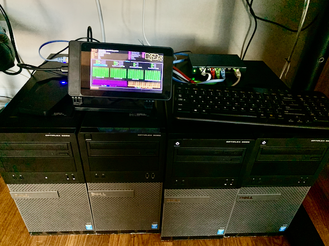

# Bootstrapping k8s using kubeadmin



## Initialize the cluster

```bash
kubeadm init --pod-network-cidr=10.0.0.0/16 (--service-dns-domain=k8s.rsletten.com)
```

## Copy config files to external workstation

```bash
mkdir -p $HOME/.kube
scp root@k8s1:/etc/kubernetes/admin.conf $HOME/.kube/config
sudo chown $(id -u):$(id -g) $HOME/.kube/config
# or
export KUBECONFIG=/etc/kubernetes/admin.conf
```

## Install Calico Networking

```bash
kubectl create -f https://docs.projectcalico.org/manifests/tigera-operator.yaml

wget -q -O - https://docs.projectcalico.org/manifests/custom-resources.yaml | \
sed -e 's/192.168.0.0/10.0.0.0/g' | \
kubectl apply -f -

kubectl taint nodes --all node-role.kubernetes.io/master-

kubectl apply -f https://docs.projectcalico.org/manifests/calicoctl.yaml
```

## Join the other nodes

```bash
ssh root@k8s2 kubeadm join 192.168.1.63:6443 \
--token akb7ie.smob7bl5vmpe6mk2 \
--discovery-token-ca-cert-hash \ sha256:9c6d9253f154a4cea8fc54d2c625d1cc9e957ae5d7df49e9ad584af92c7fd1e1

ssh root@k8s3 kubeadm join 192.168.1.63:6443 \
--token akb7ie.smob7bl5vmpe6mk2 \
--discovery-token-ca-cert-hash \ sha256:9c6d9253f154a4cea8fc54d2c625d1cc9e957ae5d7df49e9ad584af92c7fd1e1

ssh root@k8s4 kubeadm join 192.168.1.63:6443 \
--token akb7ie.smob7bl5vmpe6mk2 \
--discovery-token-ca-cert-hash \ sha256:9c6d9253f154a4cea8fc54d2c625d1cc9e957ae5d7df49e9ad584af92c7fd1e1
```

## label workers

```bash
kubectl label node k8s2.rsletten.com node-role.kubernetes.io/worker=worker
kubectl label node k8s3.rsletten.com node-role.kubernetes.io/worker=worker
kubectl label node k8s4.rsletten.com node-role.kubernetes.io/worker=worker
```

## Install baremetal loadbalancer metallb

```bash
#set strict ARP
kubectl get configmap kube-proxy -n kube-system -o yaml | sed -e "s/strictARP: false/strictARP: true/" | kubectl apply -f - -n kube-system

# apply manifests
kubectl apply -f https://raw.githubusercontent.com/metallb/metallb/v0.11.0/manifests/namespace.yaml

kubectl apply -f https://raw.githubusercontent.com/metallb/metallb/v0.11.0/manifests/metallb.yaml

# create secret
kubectl create secret generic -n metallb-system memberlist --from-literal=secretkey="$(openssl rand -base64 128)"

# Create ConfigMap for metallb
cat <<EOF | kubectl apply -f -
apiVersion: v1
kind: ConfigMap
metadata:
  namespace: metallb-system
  name: config
data:
  config: |
    address-pools:
    - name: default
      protocol: layer2
      addresses:
      - 192.168.1.250-192.168.1.250
EOF
```

## Configure rook-ceph

```bash
# prereqs
kubectl apply -f crds.yaml -f common.yaml -f operator.yaml
kubectl apply -f cluster.yaml
kubectl apply -f storageclass.yaml
kubectl apply -f toolbox.yaml
kubectl apply -f rook-dashboard-tls.yaml
# status
kubectl get CephCluster -n rook-ceph
NAME        DATADIRHOSTPATH   MONCOUNT   AGE     PHASE   MESSAGE                        HEALTH
rook-ceph   /var/lib/rook     3          6h36m   Ready   Cluster created successfully   HEALTH_OK
#
kubectl  exec -n rook-ceph -it $(kubectl get pod -l "app=rook-ceph-tools" --namespace=rook-ceph -o jsonpath='{.items[0].metadata.name}') -- ceph status
  cluster:
    id:     98c9d46b-0697-46da-bc85-0acf4828aaa8
    health: HEALTH_OK

  services:
    mon: 3 daemons, quorum a,b,c (age 4h)
    mgr: a(active, since 4h)
    osd: 4 osds: 4 up (since 4h), 4 in (since 5h)

  data:
    pools:   2 pools, 33 pgs
    objects: 4 objects, 36 B
    usage:   4.0 GiB used, 796 GiB / 800 GiB avail
    pgs:     33 active+clean

  io:
    client:   14 KiB/s rd, 16 op/s rd, 0 op/s wr
# re-deploy the operator
kubectl -n rook-ceph delete pod -l app=rook-ceph-operator
```

## cert-manager

```bash
# Create the namespace for cert-manager
kubectl create namespace cert-manager
kubectl apply -f cloudflare.yaml
helm repo add jetstack https://charts.jetstack.io
helm repo update
helm install \
  cert-manager jetstack/cert-manager \
  --namespace cert-manager \
  --version v1.6.1 \
  --set installCRDs=true
kubectl get pods --namespace cert-manager
kubectl apply -f cluster-issuer-staging.yaml
kubectl apply -f cluster-issuer-prod.yaml
```

## Ingress Option 1 - Install ingress-nginx

```bash
wget -q -O -  https://raw.githubusercontent.com/kubernetes/ingress-nginx/controller-v1.0.5/deploy/static/provider/baremetal/deploy.yaml | \
sed -e 's/type: NodePort/type: LoadBalancer/g' | \
kubectl apply -f -
```

## Ingress Option 2 - Install Traefik v2

See [Traefik.md](Traefik.md)

# Miscellanous

## Install Prometheus

```bash
helm repo add prometheus-community https://prometheus-community.github.io/helm-charts
helm repo update
kubectl create ns monitoring
helm install -n monitoring prometheus-community/kube-prometheus-stack --generate-name
kubectl apply -f prometheus/grafana-ingress-tls.yaml
```

## Install the metric server so kubectl top node works

```bash
wget https://github.com/kubernetes-sigs/metrics-server/releases/download/latest/components.yaml

- --kubelet-insecure-tls # add to Deployment containers args
```

## Install kubernetes-dashboard

```bash
helm repo add kubernetes-dashboard https://kubernetes.github.io/dashboard/
helm repo update
helm install kubernetes-dashboard kubernetes-dashboard/kubernetes-dashboard --values kubernetes-dashboard-values.yaml
kubectl apply -f kubernetes-dashboard-sa.yaml
kubectl apply -f kubernetes-dashboard-rbac.yaml
# get log in token
kubectl -n kubernetes-dashboard get secret $(kubectl -n kubernetes-dashboard get sa/admin-user -o jsonpath="{.secrets[0].name}") -o go-template="{{.data.token | base64decode}}"
```

## Install flux gitops

```bash
export GITHUB_TOKEN=...
flux bootstrap github --owner=rsletten --repository=k8s.rsletten.com --branch=main --path=./cluster/k8s.rsletten.com --personal
```

## install portainer

```bash
kubectl apply -n portainer -f https://raw.githubusercontent.com/portainer/k8s/master/deploy/manifests/portainer/portainer.yaml
kubectl apply -f misc/portainer-ingress-tls.yaml
```
